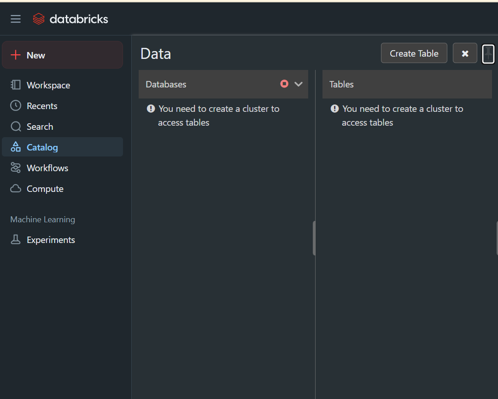
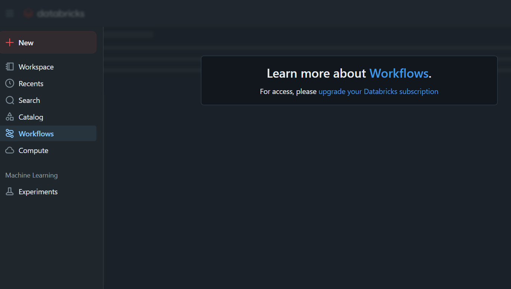
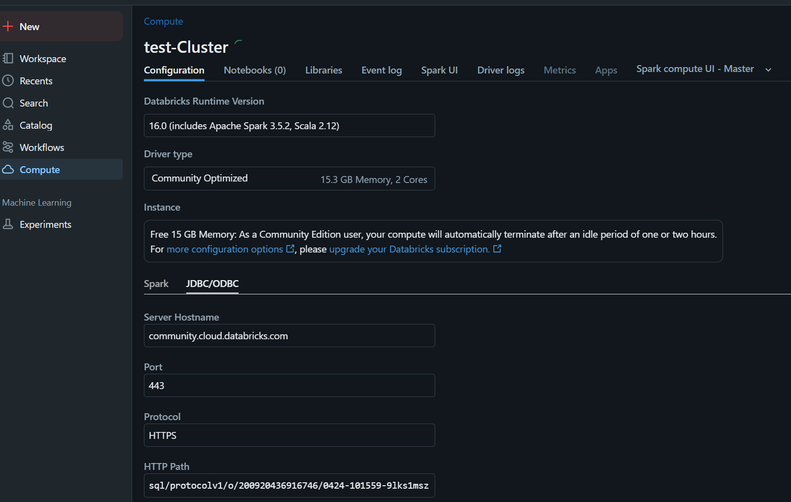
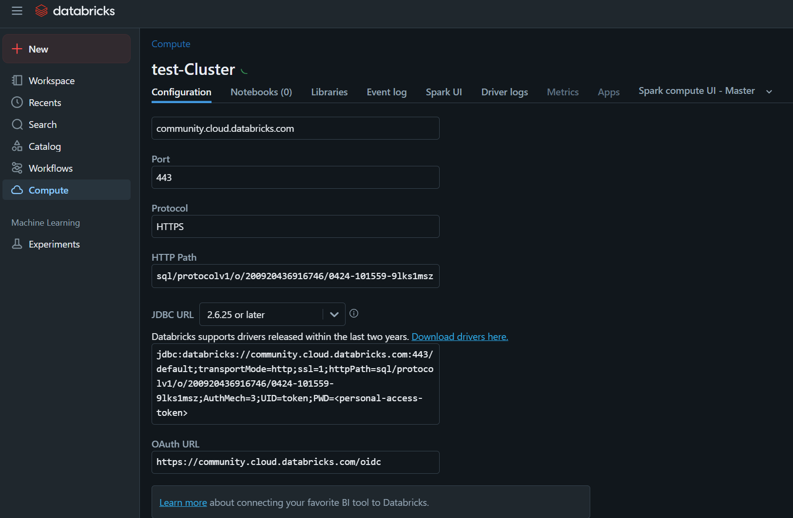
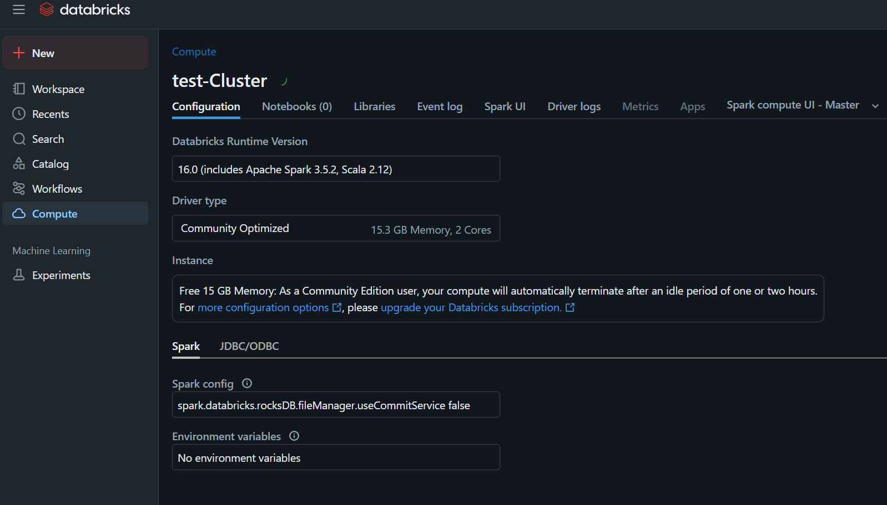

This project set up Dokcer container to define a new architecture of data Warehouse using Spark engine and DBT as SQL Compiler. We would set them up onto local machine and empower our data transformation with ``AIRBYTE, SPARK and DBT``.

Set up:
step 1: minio and spark
- [How to set up MINIO with a container](https://min.io/docs/minio/container/index.html)
- [Other reference for minio](https://www.youtube.com/watch?v=mg9NRR6Js1s)
- [Set up Spark in a container]()

### **Minio**
Minio base command ``server /data`` use ``/data`` as default work directory of Minio Server.

L’API S3 est exposée sur le port 9000.
L’interface web (console) est aussi activée… mais elle écoute sur un port aléatoire (choisi automatiquement par MinIO, genre 9002, 34441, etc.).

✅ Les clients S3 (comme Spark, AWS CLI, Python boto3...) peuvent s’y connecter.

✅ ``server /data --console-address ":9001"`` :
Il lance le service API S3 sur 9000 ET la console web d'administration MinIO sur le port 9001.

Hit ``Hostname -I`` command and pick your local ip-address like 172.xxx.xxx.xxx to connect to your minio server administration like that: http://172.xxx.xxx.xxx:9001 in your Browser.


### **Spark**
We should customized our Spark Container. We need to add Iceberg
Once spark environment set, you can add Iceberg, using the --packages option:

to connect to to S3 via iceberg from spark:
```
Example
spark = SparkSession.builder \
    .appName("IcebergTest") \
    .config("spark.sql.catalog.local", "org.apache.iceberg.spark.SparkCatalog") \
    .config("spark.sql.catalog.local.type", "hadoop") \
    .config("spark.sql.catalog.local.warehouse", "s3a://warehouse/") \
    .config("spark.hadoop.fs.s3a.endpoint", "http://minio:9000") \
    .config("spark.hadoop.fs.s3a.access.key", "minio") \
    .config("spark.hadoop.fs.s3a.secret.key", "minio123") \
    .config("spark.hadoop.fs.s3a.path.style.access", "true") \
    .getOrCreate()
```
[iceberg references](https://iceberg.apache.org/spark-quickstart/#writing-data-to-a-table)


### Architecture elements role

Component | Role
-|-
Apache Iceberg | Format de table transactionnelle pour données Big Data (ACID, snapshots, time travel…).
Spark | Moteur de traitement distribué, ici utilisé pour lire/écrire des tables Iceberg.
MinIO | Stockage objet compatible S3, ici utilisé pour stocker les fichiers de données Iceberg.
S3A | Connecteur Hadoop pour accéder aux fichiers dans un stockage S3/MinIO.


### How Iceberg interact with Spark

execute : ``df.writeTo("local.db.persons").createOrReplace()``

🔨 Iceberg does :

1. create table persons in the "catalog" named local.db.

2. Local catalog est ici un catalogue Hadoop configuré pour écrire sur s3a://warehouse/.

3. Icerberg is going to write:

- data files (parquet/orc)

- manifests

- snapshots

- le fichier de métadonnées JSON

…dans des répertoires structurés sur MinIO, dans le "bucket" warehouse.

📈 Résultat
Tu utilises Spark comme moteur de calcul.

Tu manipules des tables Iceberg (schema évolutif, ACID, time travel).

Tu stockes le tout sur MinIO, comme si c’était un S3.

Le tout fonctionne localement et sans coût, mais modélise ce qui se ferait dans le cloud (AWS S3, GCS + Iceberg, etc.).

Iceberg tables are like abstractions but the real tables are stored in Minio S3 by Spark.


### 📘 **Comparaison entre Catalog (Iceberg/Spark) et Dataset (BigQuery)**

Concept | BigQuery | Spark + Iceberg
-|-|-
"Namespace" principal | Projet GCP | Catalogue (spark.sql.catalog.local) ``local catalog``
Sous-espace logique | Dataset | Base de données (local.db)
Table | Table | Table Iceberg (local.db.table_name)
Stockage physique | GCS (ou BigLake) | HDFS / S3 / MinIO (s3a://warehouse/…)
Format | GCP interne (Colossus) | Iceberg (fichiers Parquet + metadata)


🔍 Résumé
 " "|" "
-|-
Catalog (Spark) | ≈ Projet GCP (BigQuery) → car il contient plusieurs "bases".

Database (Spark) |  ≈ Dataset (BigQuery).

Table (Spark) |  ≈ Table (BigQuery).

### Minio Client to interact with Minio
Interact with Minio easily from our terminal: do this:

```
curl -sSL https://dl.min.io/client/mc/release/linux-amd64/mc -o /usr/local/bin/mc
chmod +x /usr/local/bin/mc
```

After, create an alias to ease connection to minio:
``mc alias set myminio http://172.xxx.xxx.xxx:9000 user password``


### Integrate DBT to Iceberg/Spark

Iceberg against BigQuery

         Iceberg                     BigQuery
     ┌─────────────┐            ┌────────────────┐
     │   Catalog    │           │     Projet     │
     │   (local)    │           │ (mon-projet)   │
     └─────┬───────┘            └──────┬─────────┘
           │                            │
     ┌─────▼───────┐            ┌──────▼────────┐
     │ Namespace   │           │    Dataset     │
     │ (raw)       │           │ (raw)          │
     └─────┬───────┘            └──────┬────────┘
           │                            │
     ┌─────▼───────┐            ┌──────▼────────┐
     │   Table     │           │     Table      │
     │ transactions│           │ transactions   │
     └─────────────┘            └───────────────┘


DBT integrates with Apache Spark to facilitate data modeling and transformations, offering flexibility in data persistence and storage formats such as Iceberg, Parquet, CSV, and others.
Integrating DBT with Iceberg allows for advanced data management features, including hidden partitioning and partition evolution, which are advantageous for handling large datasets.

This [link](https://github.com/irshadgit/dbt-spark-iceberg/blob/main/) can help.

You could see the 2 workers based on our config on your browser at :
- http://localhost:8081/
- http://localhost:8082/


view this references : [link](https://pypi.org/project/dbt-spark/1.8.0/)

### Configure spark to connect to minio

A good way wiil be to create an sh script after launching our cluster

```
spark-shell \
  --jars /opt/spark/jars/iceberg-spark3-runtime.jar \
  --conf spark.sql.catalog.local=org.apache.iceberg.spark.SparkCatalog \
  --conf spark.sql.catalog.local.type=hadoop \
  --conf spark.sql.catalog.local.warehouse=s3a://weatherwarehouse/ \
  --conf spark.hadoop.fs.s3a.endpoint=http://172.xxx.xxx.xxx:9000 \
  --conf spark.hadoop.fs.s3a.access.key=user \
  --conf spark.hadoop.fs.s3a.secret.key=password \
  --conf spark.hadoop.fs.s3a.path.style.access=true
```


### 🔥 spark-shell vs spark-submit — la différence essentielle :

Outil	|Usage principal|	Mode|	Type d'exécution
-|-|-|-
spark-shell|	⚡ Mode interactif (REPL Scala)	|Interactif	|Tu tapes tes commandes à la main
spark-submit|	🚀 Lancer des scripts ou applications| Spark	Non-interactif	|Exécute un .jar ou un script .py déployer une app spark

#### Example:  Lancer un script PySpark avec spark-submit
Imaginons que tu as un fichier ``minio_test.py``, tu l’exécutes comme ceci :
```
spark-submit \
  --packages org.apache.iceberg:iceberg-spark-runtime \
  --conf spark.sql.catalog.local=org.apache.iceberg.spark.SparkCatalog \
  --conf spark.sql.catalog.local.type=hadoop \
  --conf spark.sql.catalog.local.warehouse=s3a://weatherwarehouse/ \
  --conf spark.hadoop.fs.s3a.endpoint=http://172.xx.xx.xxx:9000 \
  --conf spark.hadoop.fs.s3a.access.key=user \
  --conf spark.hadoop.fs.s3a.secret.key=password \
  --conf spark.hadoop.fs.s3a.path.style.access=true \
  minio_test.py
```

🚀 **spark-submit**
Sert à lancer une application Spark complète, généralement :

- Un ``script .py`` (PySpark)

- Un ``.jar Scala compilé``

Careful — the version of spark is important. This image uses

spark=3.5.1
python=3.11
As such, the Driver node that submits jobs must also be running ` python==3.11 and pyspark==3.5.1`

### ⚙️ dbt avec Spark : fonctionnement général
Quand tu fais tourner dbt run, dbt ne fait pas lui-même les transformations. Il génère du SQL Spark compatible (en général du Spark SQL) et le soumet au moteur Spark via le connecteur JDBC, Thrift ou spark-submit.

Donc :

Ce n’est pas du Python qui est exécuté, mais bien du SQL distribué.

C’est le SparkSession de ton backend (le Spark master, souvent) qui gère la distribution aux workers.

### Connexion de dbt à SPARK via le mode thrift
Il faudra automaiser le lancement du server thrift dans le conteneur spark-master

Dans le Dockerfile ou manuellement (exemple en bash dans le conteneur spark-master) :

````
/opt/bitnami/spark/sbin/start-thriftserver.sh \
  --master spark://spark-master:7077 \
  --conf spark.sql.warehouse.dir=/opt/bitnami/spark/warehouse
````
### cas avec databricks




On voit bien qu'il n'est pas possible de gérer des workflows databricks gratuitement









Dans tous les cas, Databricks nous montre comment se connecter à son cluster à ``2 cores et 15 GiB de Mémoire``

### How to handle data modeling on spark or databricks

See more [here](https://docs.databricks.com/gcp/en/sql/)


#### important ! Before you begin, verify that your compute or SQL warehouse is running.

go into dbt project directory:

```
cd dbt_project
dbt debug
```
You should see output similar to the following:

```
...
Configuration:
  profiles.yml file [OK found and valid]
  dbt_project.yml file [OK found and valid]

Required dependencies:
  - git [OK found]

Connection:
  ...
  Connection test: OK connection ok
```

### 🧱 3. Interface type Superset / Hue (option + avancée) Visualiser son catalogue de table avec : Apache SuperSet


Tu peux brancher Apache Superset (ou Hue) sur Spark SQL via Thrift Server (port 10000) et naviguer dans tes catalogues, bases et tables comme dans Databricks UI.

Ça demande de lancer un ThriftServer avec spark-submit comme ça :

$SPARK_HOME/sbin/start-thriftserver.sh \
  --master spark://spark-master:7077 \
  --conf spark.sql.catalog.local=org.apache.iceberg.spark.SparkCatalog \
  ... (autres options ici)
Et ensuite tu connectes Superset avec ce profil ODBC ou JDBC.

Project is in progress...
